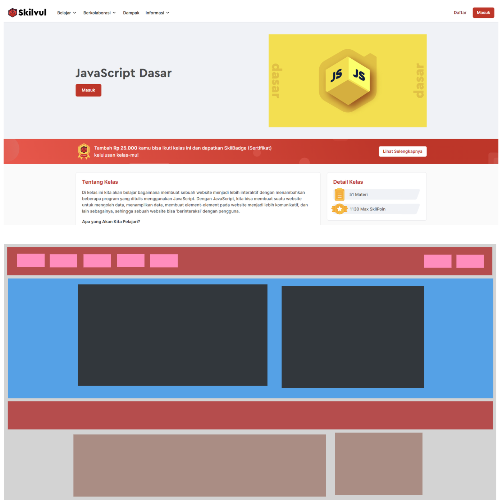

Dalam membuat halaman website, sudah pasti kita akan mengamati, menganalisa, membagi dan menentukan bagian-bagian serta _element_ dari design yang sudah disiapkan.

Perhatikan design berikut


Berdasarkan design di atas, ternyata sebuah halaman terdiri dari beberapa bagian atau **_component_**

_**Component**_ pada React adalah **bagian-bagian dari tampilan UI**. Seperti `Navbar`, `Footer`, `Button`, dan sebagainya. Kita  bebas menentukan seberapa besar atau kecil komponen yang akan dibuat sesuai dengan kebutuhan.

Dengan adanya _component_, dapat memberikan keuntungan seperti:
- _Component_ dapat digunakan berkali-kali
- _Component_ dapat memiliki logika masing-masing
- Kode menjadi lebih mudah dibaca dan dikelola
- Lebih mudah menememukan bug

Dari kode yang awalnya menumpuk seperti ini:

```html
<div>
  <!-- Navbar -->
  <header>
    <nav>
      <ul>
        <li><li>
        <li><li>
        <li><li>
      </ul>
    </nav>
  </header>

  <!-- Hero section -->
  <main>
    <section>
    </section>

    <section>
    </section>
  </main>
</div>
```
Menjadi seperti ini

```html
<div>
  <Navbar />
  <Hero />
</div>
```

Wow!!! menarik bukan?

Selanjutnya kita akan belajar bagaimana caranya membuat komponen pada React

# Quiz

### 5 Point
Apa yang dimaksud dengan component dalam konteks pembuatan halaman website?
- [ ] Bagian kecil dari komputer
- [x] Bagian dari tampilan UI
- [ ] Bagian dari kode JavaScript
- [ ] Bagian dari server backend

### 5 Point
Apa manfaat komponen dalam React?
- [ ] Mengurangi kegunaan komponen dalam pengembangan web
- [ ] Membuat kode menjadi lebih rumit dan panjang
- [x] Memudahkan pengembangan, pemeliharaan, dan penggunaan ulang komponen
- [ ] Mengurangi kinerja halaman web secara keseluruhan