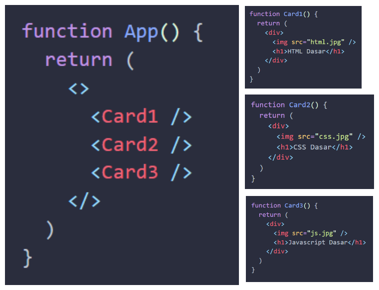

**Props** adalah singkatan dari _Properties_. **Props** berguna untuk **mengoper data** dari _parent component_ ke _child component_. Bersifat satu arah (_parent_ ke _child_) dan dapat menjadikan komponen  lebih dinamis.

Props dapat digunakan untuk mengoper data _**string, number, boolean, array, object, dan function**_

Supaya lebih jelas, coba kamu perhatikan kode dan gambar di bawah ini. 





Misalnya kamu ingin menampilkan `Card` dengan data yang berbeda. Mungkin cara yang terpikirkan saat ini adalah dengan membuat komponen `Card1`, `Card2`, `Card3` dan seterusnya sebanyak yang kamu butuhkan. 

Lalu gimana kalau datanya ada 100 atau mungkin 1000??

Dari pada kamu membuat 1000 `Card` yang berbeda, kamu hanya butuh 1 component `Card` yang dapat menerima data. Sehingga menjadi seperti ini:

```jsx
// Card.jsx
function Card(props) {
  return (
    <div>
      
      <h2>{props.name}</h2>
    </div>
  );
}

// App.jsx
function App(){
  return (
    <>
      <Card img="html.png" name="HTML Dasar" />
      <Card img="css.png" name="CSS Dasar" />
      <Card img="javascript.png" name="javascript" />
    </>
  )
}
```

Pada kode di atas, kita panggil `Card`, lalu berikan _props_ `img` dan `name`. Di dalam komponen `Card`, tambahkan parameter `props` untuk dapat menangkap data _props_ yang sudah dioper.

> **Note**</br>
> Mengoper _props_ pada komponen mirip seperti mengoper argumen ke dalam function.

---
Untuk mengasah pemahaman mu, silahkan ikuti eksperimen berikut.

1. Buat state kucing dengan tipe data object yang memiliki properti nama (string), warna (string), makanan (array)
2. Tampilkan data tersebut

Hasilnya seperti ini

# Quiz

Apa fungsi utama dari "Props" dalam React?
- [ ] Menambahkan efek animasi pada komponen
- [ ] Mengoper data dari child component ke parent component
- [x] Mengoper data dari parent component ke child component
- [ ] Mengubah tampilan halaman web secara keseluruhan