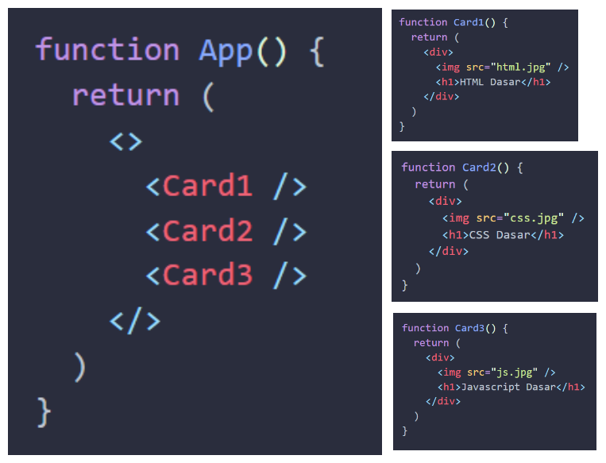
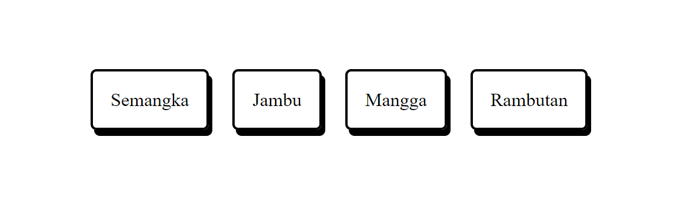

**Props** adalah singkatan dari _Properties_. **Props** berguna untuk **mengoper data** dari _parent component_ ke _child component_. Bersifat satu arah (_parent_ ke _child_) dan dapat menjadikan komponen  lebih dinamis.

Props dapat digunakan untuk mengoper data _**string, number, boolean, array, object, dan function**_

Supaya lebih jelas, coba kamu perhatikan kode dan gambar di bawah ini. 





Misalnya kamu ingin menampilkan `Card` dengan data yang berbeda seperti contoh di atas. Mungkin cara yang terpikirkan saat ini adalah dengan membuat komponen `Card1`, `Card2`, `Card3` dan seterusnya sebanyak yang kamu butuhkan. 

Lalu gimana kalau datanya ada 100 atau mungkin 1000??

Dari pada kamu membuat 1000 `Card` yang berbeda, kamu hanya butuh 1 component `Card` yang dapat menerima data. Sehingga menjadi seperti ini:

```jsx
// Card.jsx
function Card(props) {
  return (
    <div>
      
      <h2>{props.name}</h2>
    </div>
  );
}

// App.jsx
function App(){
  return (
    <>
      <Card img="html.png" name="HTML Dasar" />
      <Card img="css.png" name="CSS Dasar" />
      <Card img="javascript.png" name="javascript" />
    </>
  )
}
```

Pada kode di atas, kita panggil `Card` dengan memberikan _props_ `img` dan `name`. Di dalam komponen `Card`, `props` akan diterima pada bagian parameter dan bisa langusung didestruktur menjadi `{name, img}`.

> **Note**</br>
> Mengoper _props_ pada komponen mirip seperti mengoper argumen ke dalam function.

---
Untuk mengasah pemahaman mu, silahkan ikuti eksperimen berikut.

1. Buat komponen `CardBuah` yang dapat menerima props `nama`, dan tampilkan props tersebut
2. Buat variabel _array_ buah di dalam `App`
3. Lakukan `map` pada data _array_ dan beri `props` ke dalam `CardBuah`

Hasilnya seperti ini :


# Quiz

### 5 Point
Apa fungsi utama dari "Props" dalam React?
- [ ] Menambahkan efek animasi pada komponen
- [ ] Mengoper data dari child component ke parent component
- [x] Mengoper data dari parent component ke child component
- [ ] Mengubah tampilan halaman web secara keseluruhan

### 15 Point
Jika ingin mengirim fungsi sebagai prop ke dalam komponen `CardBuah`, apa yang harus dilakukan?
- [ ] Fungsi tidak bisa dikirim sebagai prop.
- [ ] Menginisialisasi fungsi di dalam komponen CardBuah.
- [ ] Mengirimkan fungsi sebagai prop seperti ini `namaFungsi={namaFungsi()}`
- [x] Mengirimkan fungsi sebagai prop seperti ini `namaFungsi={namaFungsi}`