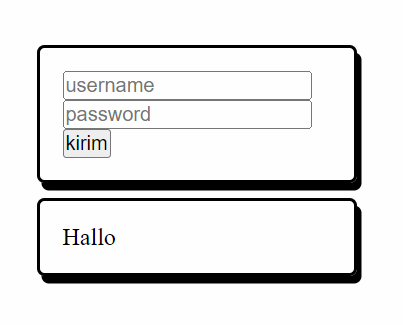

Pada topik sebelumnya, data dapat dioper dari `parent` ke `child` melalui `props`. Kali ini kita akan mencoba mengoper komponen ke dalam komponen melalui `props`.

Coba perhatikan gambar dibawah:


Terdapat 2 halaman atau komponen yang berbeda tetapi memiliki komponen/style yang sama.

Untuk membuat seperti contoh gambar di atas, kita dapat membuat komponen _**layout**_ yang dapat menerima sebuah komponen, lalu memanfaatkan `props.children` supaya lebih dinamis.

Berikut contoh kodenya:

```jsx
function PageLayout(props) {
  return (
    <div>
      <Navbar />
      {props.children}
      <Footer />
    </div>
  );
}

function App() {
  return (
    <PageLayout>
      <Home />
    </PageLayout>
  );
}
```

Dari kode di atas, `PageLayout` dipanggil dengan tag pembuka dan tag penutup untuk membungkus `Home`. Dengan begitu `Home` akan dioper dan masuk kedalam `props.children`.

```jsx
<div>
  <Navbar />;
  <Home />
  <Footer />;
</div>
```

---

Untuk mengasah pemahaman mu, silahkan ikuti eksperimen berikut.

1. Buat komponen `CardContainer`
2. `CardContainer` memiliki JSX `<div>` yang diberi styling

```css
widht: 100%;
border: 1px solid black;
box-shadow: 3px 5px;
border-radius: 5px;
```

3. `CardContainer` dapat menerima props, dan panggil `props.children` diantara `<div>` tersebut
4. Pada komponen `App`, buat sebuah form yang dibungkus oleh `CardContainer`.
5. Lalu buat lagi paragraf yg dibungkus oleh `CardContainer`

Hasilnya seperti ini :


# Quiz

### 5 point

Apa yang dimaksud dengan `props.children`?

- [ ] Sebuah properti untuk mengubah tampilan komponen
- [ ] Sebuah cara untuk mengirim data antar komponen
- [x] Sebuah properti yang digunakan untuk mengakses elemen _child_ dari suatu komponen
- [ ] Sebuah metode untuk membuat komponen lebih statis

### 15 point
Bagian manakah yang salah?
```jsx
function CardContainer({props}){
  return (
    <div className="card">
      {props.children}
    </div>
  )
}
```
- [ ] Komponen harus dibuat pakai arrow function
- [ ] `<div>` harus dibungkus oleh React.Fragment `<>`
- [x] Parameter `props` tidak perlu di destruktur
- [ ] Semua salah
