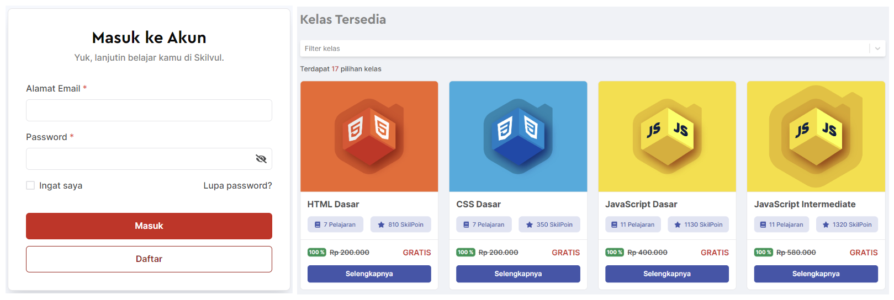

Sebagai developer React, pertama kita harus menganalisa sebuah _design_ untuk mengetahui data apa saja yang harus disiapkan.

Coba perhatikan contoh _design_ dibawah ini.

Pada Komponen `Login` (gambar sebelah kiri), user dapat menginput _email_ dan _password_. Dan pada komponen `ListKelas`, terdapat tampilan dari daftar kelas skilvul. 

Komponen `Login` memiliki data _**email**_, dan **_password_** yang di-_input_ oleh user. Komponen `ListKelas` memiliki data **daftar kelas** yang akan ditampilkan. Jika diperhatikan kembali, ke-2 komponen tersebut memiliki kesamaan, yaitu datanya dapat dikelola dan bersifat dinamis.

Jika pada sebuah komponen yang akan dibuat memiliki **data yang dapat dikelola**, kita dapat menggunakan **_state_** untuk menyimpan data tersebut.

**Lalu apa bedanya dengan props?**

**_State_** adalah data yang lahir pada sebuah komponen dan dapat diubah (_mutable_). Sedangkan _**Props**_ adalah data yang dioper dari _parent_ ke _child_ dan tidak dapat diubah (_immutable_)

Contoh kasus menggunakan _state_
- Menyimpan data dari _text input_
- Menyimpan data hasil _fetch_
- Menyimpan kondisi dari sebuah modal
- Menyimpan data bersifat dinamis dan dapat dikelola

Selanjutnya kita akan belajar bagaimana caranya membuat `state` pada React

# Quiz

### 5 Point
Kapan sebaiknya kita menggunakan "state" dalam pengembangan React?
- [x] Ketika kita ingin menyimpan data bersifat dinamis yang dapat diubah
- [ ] Ketika kita ingin mengoper data dari parent ke child
- [ ] Ketika kita ingin membuat tampilan komponen lebih kompleks
- [ ] Ketika kita ingin menggabungkan beberapa komponen menjadi satu

### 5 Point
Apa bedanya state dan props?
- [ ] State adalah data yang dioper, sedangkan props data yang lahir pada komponen
- [ ] State data yang dioper dari parent ke child, sedangkan props dioper dari child ke parent
- [ ] State bersifat _immutable_ sedangkan props _mutable_
- [x] State bersifat _mutable_ sedangkan props _immutable_