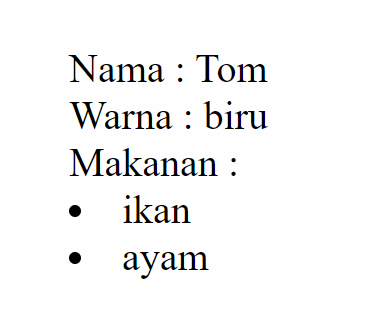

Pada topik sebelumnya kita sudah belajar tentang bagaimana caranya menyimpan data dinamis menggunakan _state_. 

**Lalu bagaimana caranya membuat state?**

Di sini kita membutuhkan `useState` yang berasal dari `react`.

```jsx
// di luar komponen
import { useState } from "react"

// di dalam komponen
const [state, setState] = useState("value")
```

`useState` akan mengembalikan data dalam bentuk _array_, sehingga ketika dideklarasi bisa kita tulis dengan cara _destructure_ seperti ini  `[state, setState]`. Dari hasil _destructure_ kita mendapatkan `state` yang bernilai data yang ingin disimpan, dan `setState` adalah function untuk mengubah data tersebut.

Contoh:

```jsx
import { useState } from "react"

function Profile () {
  const [name, setName] = useState("Terra")

  return (
    <div>
      
      <h2>{name}</h2>
    <div>
  )
}
```

Pada kode di atas, kita membuat state `name` yang bernilai `"Terra"`. Kemudian `name` ditampilkan pada tag `<h2>`.

Lalu gimana cara mengubah _state_-nya? 

Untuk mengubah state, kita perlu 
```
setState(newValue)
```
Contoh:
```jsx
setName("Alpha")
```
Mengubah state akan kita pelajari kembali pada **lesson Event Handling**

---
Untuk mengasah pemahaman mu, silahkan ikuti eksperimen berikut.

1. Buat state `kucing` dengan tipe data object yang memiliki properti nama (_string_), warna (_string_), dan makanan (_array_)
2. Tampilkan data tersebut pada JSX

Hasilnya seperti ini


# Quiz

### 5 Point
Bagaimana cara mengimpor useState dalam sebuah komponen React?
- [ ] import useState from "react"
- [x] import { useState } from "react"
- [ ] import useState from "react-state"
- [ ] import { useState } from "react-dom"

### 15 Point
Berdasarkan soal latihan, manakah yang benar untuk menampilkan data makanan kucing?
- [ ] 
```jsx
<li>{kucing.makanan}</li>
```
- [ ] 
```jsx
{makanan.map(item => (
  <li>{item}</li>
))}
```
- [x] 
```jsx
{kucing.makanan.map(item => (
  <li>{item}</li>
))}
```
- [ ] Semuanya salah