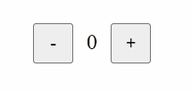

Menangani klik mouse pada suatu element, kita bisa menggunakan props `onClick`. Bisa diletakkan pada semua element yang ingin diberi klik. 

Contohnya seperti ini:

```jsx
function App() {
  function handleClick() {
    console.log("dunia")
  }

  return (
    <>
      <h1 onClick={handleClick}>hallo</h1>
    </>
  );
}
```
Kode di atas, akan menampilkan `"dunia"` pada `console` jika text `"hallo"` di-klik

Kita juga bisa mengkombinasikannya dengan state supaya data dapat berubah jika di klik. Seperti ini contohnya:

```jsx
function App() {
  const [greeting, setGreeting] = useState("Say")

  function handleClick() {
    setGreeting("Hello")
  }

  return (
    <>
      <h1 onClick={handleClick}>{greeting}</h1>
    </>
  );
}
```

Pada kode di atas, _text_ `"Say"` yang muncul akan berubah menjadi `"Hello"` jika di-klik

_Text_ `<h1>` di atas berasal dari _state_ `greeting` dan  dapat diklik karena memiliki `onClick` yang akan memanggil function `handleClick`. Ketika diklik maka _function_ `handleClick` dijalankan untuk mengubah _state_ `"Say"` menjadi `"Hello"` menggunakan `setGreeting("Hello")`.

## Latihan
Untuk mengasah pemahaman mu, silahkan ikuti eksperimen berikut.

1. Buat komponen `Counter`
2. Buat state `counter` bernilai `0`
2. Memiliki _button_ `-` dan `+`
3. Menampilkan angka `0` yang berasal dari _state_. Diletakkan antara _button_
4. Beri `onClick` pada _button_ supaya angka dapat berkurang dan dapat bertambah sesuai dengan tombolnya

Hasilnya seperti ini :


# Quiz

### 5 point
Dalam contoh pertama, apa yang akan terjadi ketika teks "hallo" diklik?

- [ ] Teks "Say" akan berubah menjadi "Hello".
- [ ] Teks "hallo" akan berubah menjadi "dunia".
- [ ] Teks "hallo" akan muncul di console.
- [x] Teks "dunia" akan muncul di console.

### 15 Point
Lengkapilah `onClick` pada element `<li>` yang akan menampilkan `index` dan `buah` pada `console` browser
```jsx
function App() {
  const [listBuah, setListBuah] = ["Jeruk", "Pepaya", "Mangga"]

  function itemClick(index, buah) {
    console.log(index, buah)
  }

  return (
    <>
      {buah.map((item, index) => (
        <li key={index} onClick={}>{item}</li>
      ))}
    </>
  );
}
```
- [ ] `onClick={itemClick}`
- [ ] `onClick={itemClick()}`
- [ ] `onClick={itemClick(index, buah)}`
- [x] `onClick={() => itemClick(index, buah)}`