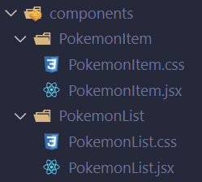

Selamat, kamu sudah pada tahap akhir pembelajaran!!

Kali ini, kita akan membuat proyek sederhana dengan menerapkan apa yang sudah dipelajari pada topik sebelumnya.

Diharapkan dari project ini kamu mampu untuk

- Membuat website menggunakan react
- Menerapkan penggunaan dari topik yang sudah dipelajari

Berikut adalah project yang akan kamu buat.


## Silahkan ikuti langkah-langkah di bawah ini :

- Install react

```jsx
npm create vite@latest
```

- Reset project dengan menghapus file `App.css` dan hapus semua kode di `App.jsx` hingga tersisa seperti ini

```jsx
function App() {
  return <></>;
}

export default App;
```

- Reset styling pada `index.css` dan tambahkan jenis font

```css
@import url("https://fonts.googleapis.com/css2?family=Jura:wght@300;500;700&display=swap");

* {
  margin: 0;
  padding: 0;
  box-sizing: border-box;
  font-family: "Jura", sans-serif;
}
```

### Menampilkan list pokemon

- Buat folder `components` dan `data` di dalam `src`

- Pada folder `data`, buat `pokemon.json` lalu ambil data pokemon [di sini](https://github.com/auzanassdq/react-basic-pokemon/blob/main/src/data/pokemon.json)

- Pada folder `components`, buat beberapa file seperti ini



- `PokemonList.jsx`, simpan data pokemon yang berasal dari file json ke dalam _state_ lalu tampilkan dengan `map`

```jsx
import pokemonJSON from "../../data/pokemon.json";

import "./PokemonList.css";

function PokemonList() {
  const [pokemons] = useState(pokemonJSON);

  return (
    <div>
      <div className="list-pokemon">
        {pokemons.map((item) => (
          <h1>{item.name}</h1>
        ))}
      </div>
    </div>
  );
}

export default PokemonList;
```

- `PokemonList.css` beri styling pada `list-pokemon`

```css
.list-pokemon {
  display: flex;
  justify-content: center;
  gap: 30px;
  flex-wrap: wrap;
  margin: 100px auto;
}
```

- `App.jsx`, munculkan komponen `PokemonList`

```jsx
import PokemonList from "./components/PokemonList/PokemonList";

function App() {
  return (
    <>
      <PokemonList />
    </>
  );
}

export default App;
```

- Jalankan proyek dan lihat data pokemon yang sudah tampil

- `PokemonItem.jsx`, berikutnya buat _card_ untuk masing-masing data pokemon yang dapat menerima sebuah props `pokemon`. Pada card ini, kita akan menampilkan gambar, nama, tipe, dan deskripsi dari Pokemon

```jsx
import "./PokemonItem.css";

import { colours } from "../../data/colours";

function PokemonItem({ pokemon }) {
  return (
    <div
      className="pokemon-card"
      style={{
        backgroundColor: `${pokemon.color}`,
      }}
    >
      
      <h1>{pokemon.name}</h1>

      {/* taro badge di sini */}

      <p className="description">{pokemon.description}</p>
    </div>
  );
}

export default PokemonItem;
```

- `PokemonItem.jsx`, tambahkan badge pokemon di bawah nama pokemon. `types` adalah data array yang harus di `map` untuk bisa ditampilkan

```jsx
<div className="types-container">
  {pokemon.types.map((item, index) => (
    <span
      key={index}
      className="type-badge"
      style={{
        backgroundColor: colours[item.toLowerCase()],
      }}
    >
      {item}
    </span>
  ))}
</div>
```

- Buat file `colours.js` di dalam folder `data`. pilihan warna ini untuk mewarnai badge dari tipe pokemon

```js
export const colours = {
  normal: "#A8A77A",
  fire: "#EE8130",
  water: "#6390F0",
  electric: "#F7D02C",
  grass: "#7AC74C",
  ice: "#96D9D6",
  fighting: "#C22E28",
  poison: "#A33EA1",
  ground: "#E2BF65",
  flying: "#A98FF3",
  psychic: "#F95587",
  bug: "#A6B91A",
  rock: "#B6A136",
  ghost: "#735797",
  dragon: "#6F35FC",
  dark: "#705746",
  steel: "#B7B7CE",
  fairy: "#D685AD",
};
```

- `PokemonItem.css`, tambahkan styling untuk detil-detil pada card pokemon

```css
.pokemon-card {
  width: 300px;
  border-radius: 10px;
  text-align: center;
  padding: 20px;
  border: 2px solid black;
  box-shadow: 5px 5px black;
  position: relative;
  overflow: hidden;
}

.pokemon-card > .types-container {
  display: flex;
  justify-content: center;
  gap: 30px;
  margin: 20px 0 0;
}

.type-badge {
  width: 100px;
  padding: 4px;
  border-radius: 6px;
  border: 2px solid black;
  color: white;
}

.pokemon-card .description {
  text-align: left;
  padding: 20px;
  font-size: 1.3rem;
  position: absolute;
  bottom: 0;
  left: 0;
  background-color: white;
  transition: all 0.3s ease-in-out;
  translate: 0 100%;
}

.pokemon-card:hover .description {
  translate: 0 0;
}
```

- Panggil `PokemonItem` pada `map` yang ada di dalam `PokemonList`. Serta berikan _props_ untuk data tersebut

```jsx
pokemons.map((item) => (
  <PokemonItem 
    key={item.id} 
    pokemon={item} 
  />
));
```

- Selamat, Data pokemon sudah tampil

### Menambahkan Search

- `PokemonList.jsx`, tambahkan text input sebelum div `.list-pokemon`. text input diberi `onChange` untuk merekam setiap ketikan

```jsx
<input
  type="text"
  placeholder="cari pokemon..."
  className="search"
  onChange={handleSearch}
/>
```

- `PokemonList.jsx`,tambahkan state `filterPokemons`

```jsx
const [filterPokemons, setFilterPokemons] = useState(pokemonsJson);
```

- `PokemonList.jsx`, buat _function_ `handleSearch` untuk filter data pokemon yang sesuai dengan hasil text pada pencarian

```jsx
const handleSearch = (e) => {
  let search = pokemons.filter((item) => {
    return item.name.toLowerCase().includes(e.target.value);
  });

  setFilterPokemons(search);
};
```

- `PokemonList.jsx`, ubah `pokemons` pada `map` menjadi `filterPokemons` dan tambahkan kondisi jika data tidak ditemukan pada `.list-pokemon`

```jsx
<div className="list-pokemon">
  {filterPokemons.length == 0 ? (
    <div>data tidak ditemukan</div>
  ) : (
    filterPokemons.map((item) => (
      <PokemonItem 
        key={item.id} 
        pokemon={item} 
      />
    ))
  )}
</div>
```

- `PokemonList.css`, tambahkan styling untuk `.search`

```css
.search {
  display: block;
  width: 70vh;
  padding: 15px;
  margin: 50px auto 50px;
  font-size: 1rem;
  box-shadow: 3px 5px;
  border-radius: 5px;
  border: 2px solid black;
}
```

- Selamat.. fitur pencarian sudah selesai

Source code [di sini](https://github.com/auzanassdq/react-basic-pokemon/)
